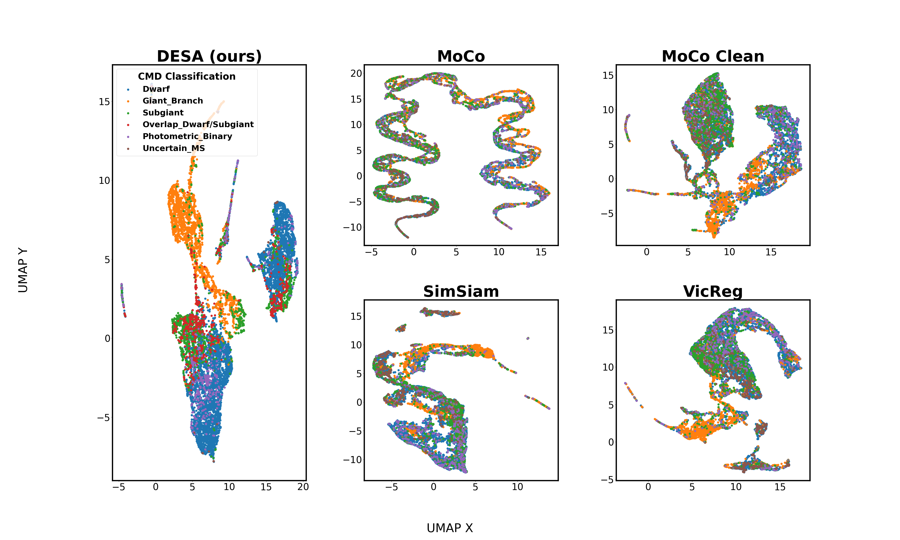

# DESA - Dual Embedding model for Stellar Astrophysics

*DESA architecture*

DESA is a multimodal model for stellar data. DESA consists of pretrianed spectra and light curve encoders and a novel modula, DualFormer, that effectively aligns the induvidual embeddings. DESA outperforms other well-known self supervised and multi modality framework on a veriaty of tasks including zero-shot, few-shot and fine-tuning on challenging astronomical datasets.  

## Setup Environment

You can download a copy of all the files in this repository by cloning the
repository:

    git clone https://github.com/IlayMalinyak/DESA.git
    cd DESA
    pip install -r requirements.txt

## Run Experiments
training was done in a multi-gpu slurm-based environemnt with. To run experiments on other environemtns, some small modifications are needed.
all experiments can be found in [src](https://github.com/IlayMalinyak/DESA/tree/main/src)
folder.

## Results

*final features UMAP*

*binary detection experiment results*